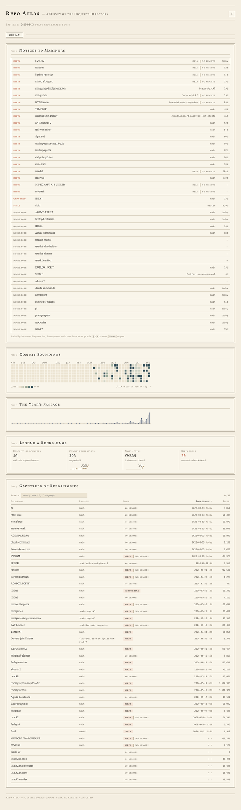

# repo-atlas — overnight build report

**Repo Atlas — Survey Folio**: a local mission-control dashboard that surveys every git repo under `~/Projects` (39 found tonight) and renders them as an early-20th-century cartographic atlas — attention queue first, then commit heatmap, timeline, Gazetteer, and per-repo drill-down plates. Built, reviewed, QA'd, taste-tested, and its one fundamental taste gap fixed — in one evening.



## Run it

```
npm start
```

Serves at **http://localhost:4600**. First survey takes ~60–90 s (cache-first afterward). `npm test` → 228 vitest tests, non-interactive.

## Must-haves

| Must-have | Status | Reason / evidence |
|---|---|---|
| Auto-scan all git repos under ~/Projects (branch, dirty, ahead/behind, history, LOC) | ✅ shipped | 39 real repos surveyed; conductor probes: behind-only clone parsed correctly, node_modules decoy excluded, dirty flags matched `git status --porcelain` ground truth 4/4 (journal cycles 4, 5, 12) |
| Attention-first overview + heatmap/timeline | ✅ shipped | QA scenario S1: full-queue reconciliation vs independent git answer key over 39 repos, exact order match; S3: heatmap counts match `git log --date=format-local` (cycle 12) |
| Per-project drill-down | ✅ shipped | Fig. 6–10 plates + **Fig. 9a Unlogged Cargo** (uncommitted files — added after the taste gate); live-verified badge "dirty — 3 modified, 3 untracked" == porcelain 6 entries (cycles 5, 14) |
| Live refresh without restart | ✅ shipped | SSE progress + atomic swap; conductor probe: exactly 1 terminal `done` per scan on a 20 s persistent connection after the R-015 fix (cycles 6, 11) |

Nice-to-haves shipped: Gazetteer search/sort, dark/light themes, stats row, j/k + Enter keyboard nav, Cmd+K fuzzy palette, heatmap day-click cross-filter (readout-level), queue selection preserved across drill-down round-trips.

## Decisions log

- cycle 1: TASTE-FORWARD "Survey Folio" design + 6 grafted judge steals — blind judge 43/50, only brief covering the full-repo Gazetteer DoD line
- cycle 13: taste verdict **wears-thin** with a fundamental (dirty drill-down never showed *what's* dirty) — remaining clock re-aimed at depth (D-016/D-017/P-018), polish deferred

## Known issues

- KI-1 (resolved): SSE reconnect replay loop — fixed R-015, verified live cycle 11
- KI-2 (low): server test flake — cache-seed-race test got null content-type on SSE connect once + once under shuffle, not in 17 subsequent runs; needs a deflake look — found cycle 14
- Tool note (SWARM, not the product): review-fix assigned one fixer a SWARM worktree (fence blocked it; fixes relanded next cycle); F-014's first builder died at the StructuredOutput retry cap

## Night log

- c1 design panel (winner C, 43/50) · c2 PLAN 11 items · c3 contract frozen (37 tests, mutation-probed)
- c4–c6 parallel build waves: git facts, attention, charts, scanner, hooks, drill-down, server, shell — 173 tests, app LIVE on :4600
- c6–c7 look passes: 9 rendered-page defects found and filed; F-012 (dirty zero-commit repos missing from queue) fixed + parity 23=23
- c8 F-013 chart fixes landed on opus attempt 2 (conductor false-fail traced to a stale browse page — journaled)
- c10 review-fix: 10 findings, 8 reproduced, 2 HIGH server bugs no test saw · c11 SSE lifecycle fixed, verified with a persistent-connection probe
- c12 QA full: 3/3 scenarios vs independent git answer keys · c13 taste: wears-thin + 1 fundamental · c14 fundamental FIXED and live-verified (Fig. 9a)

## Night control log

_No commands received._

## Stats

| Stat | Value |
|---|---|
| Cycles run | 15 |
| Commits | 61 (main, all conductor-made, green throughout; 1 revert + reland) |
| Agents dispatched | ~40 (4 design, 1 plan, 16 builders, 7 review-fix, 5 QA/look/taste, + probes) |
| Models used | fable (design/judge/verify/core/taste), opus (reviewers, shell, relands), sonnet (UI/build), per value-routing |
| Notifications sent | 9 |
| Pace | mode thermostat dial 1.0, gear range 4–5, no window reset before stop (utilization n/a), voluntary idle cycles: 0 |

## Honest hand-off

**Machine-checked:** 228 unit/integration tests (contract mutation-probed); QA scenarios verified against independent git answer keys over the real ~/Projects; SSE single-done probe; live look passes with screenshots; taste fundamental re-verified live.

**Only a human can finish:**
- **The 10-use taste tail** — deferred as backlog item P-019, from the taste pass: acknowledgeable/mutable notices + demoting bare "no remote" rows (queue noise floor), an "edition delta" (what changed since last survey), making the day-click actually filter the Gazetteer, adaptive plates for dormant repos, sparkline value labels, rescan progress repo names. These are the difference between "handsome" and "daily habit".
- **KI-2 deflake** (one flaky server test under shuffle).
- **Security tail**: path traversal is tested, but no fuzzing/audit was run on the HTTP layer — it binds localhost only.
- **Design spot-check**: the folio identity is consistent per the look passes, but a human eye on typography at real window sizes is worth 10 minutes.

---

Repo tagged `v0.1-overnight`. Generated by /swarm WRAP_UP at 2026-08-13T21:50:00-05:00.
